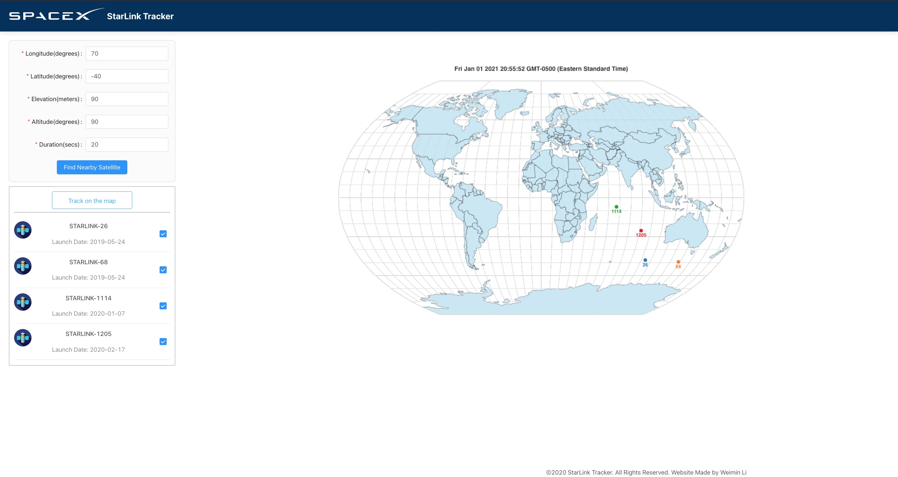

# starlink_express
 A Customized starlink tracking

## deployed at:
http://3.129.248.50/
## api offered by:
https://www.n2yo.com/api/

## how to use
1. Choose the Longitude, latitude, elevation, Altitude, and Duration. Then the app will show the satellites based on your choice.
2. Choose the satellites you want to show on the map, then the app will start track the satellite on the map.

